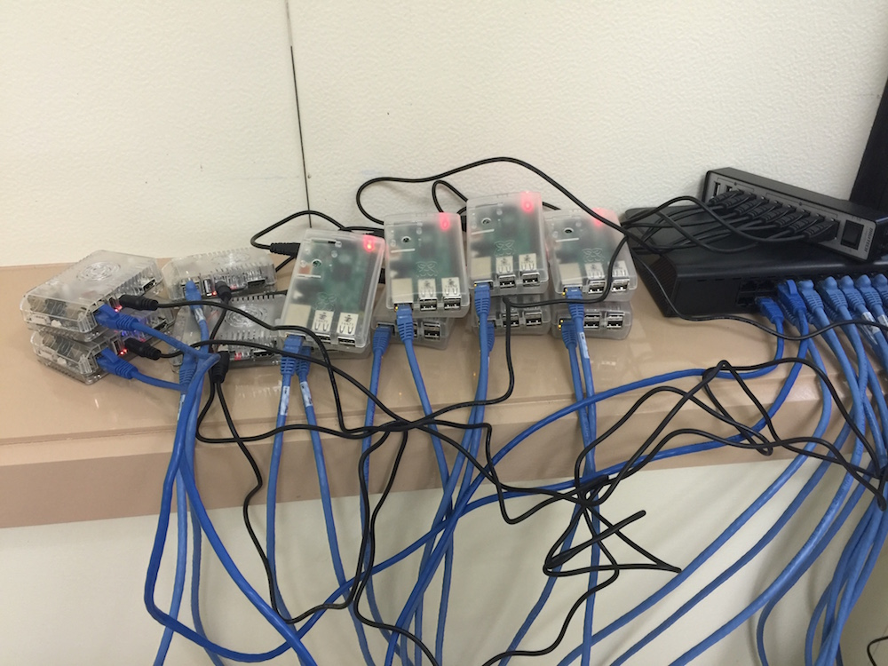
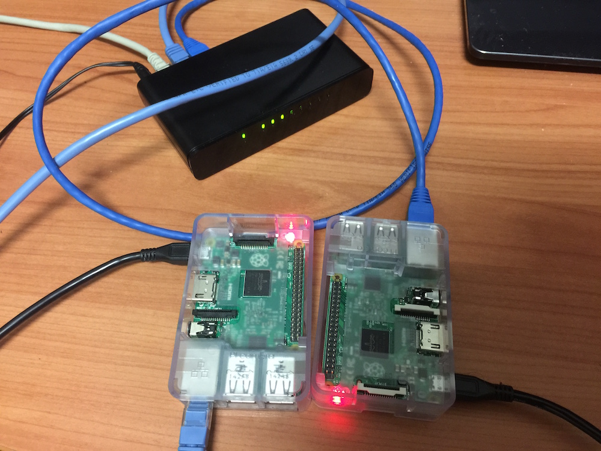

# Intro to cluster computing

## Computing clusters and why they're useful

## Why we need to run code in parallel

## Parallelising code with MPI on clusters

## Using MPI in your Python and R code

## Master and slave machines

## Raspberry Pi Cluster

## How we can use MPI through Python and R
