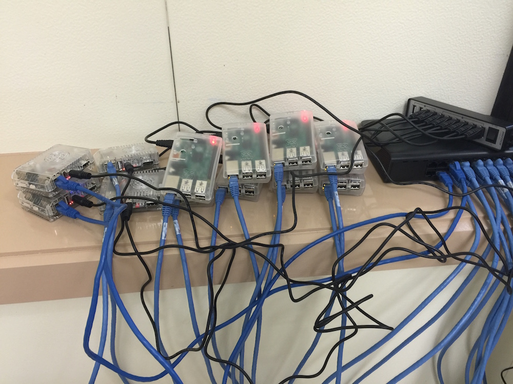

# PiCluster Workshop

## Description
Workshop Materials for introducing researchers to running parallel code on computer clusters using Python via the MPI4Py package.

We'll be using the Raspberry Pi cluster we built ourselves to run the code taught in this workshop.

## Prerequisites

It is assumed that participants will have a basic understanding of Python - equivalent to what they would have acquired attending a Software Carpentry workshop.

## Workshop structure

The workshop consists of a background section introducing participants to parallel processing and MPI. After that, the lessons will then focus on using Python to run your scripts in parallel.

#### Background

The `Intro.md` file introduces this workshop and the following concepts:
* Computing clusters and why they're useful
* Why we need to run code in parallel
* Parallelising code with MPI on clusters
* Master and slave machines
* Using MPI in your Python and R code
* Raspberry Pi Cluster
* How we can use MPI through Python and R
* Using this on your own multicore computers

#### Sync

The `sync` directory contains instructions and scripts to sync data and code between computers in the cluster.

#### Python

Python materials are located within the Python directory and follow the following format:

* Hello world script

## Program Requirements

This workshop will require the following software:
* [Python programming language](https://www.python.org/)
* MPI4Py (Python package)
* rsync: to sync files on the cluster

## Example Dataset

The example datasets are contained within the `data` directory.

## Cluster Setup

The `cluster_setup` directory contains an outline of how the cluster was setup. Please note that this is still under development and is mainly a collection of random notes I kept at the time which I'll refine later.

## Licence
This software is shared under the [MIT license](http://choosealicense.com/licenses/mit/) which means you're free to do whatever you like with the code so long as you provide attribution.
